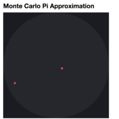
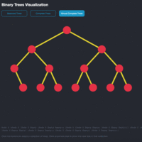

# Cool Elm Stuff

This repository contains some cool stuff I implemented in [Elm](http://elm-lang.org/), as a part of my coursework in [CMSC 22300: Functional Programming](https://www.classes.cs.uchicago.edu/archive/2016/winter/22300-1/) in Winter 2016 at UChicago.

Fun fact: Chicago should be pronounced as "shi-ka-go". I just learned it from [The UChicago χ-Projects](http://chi.cs.uchicago.edu/about.html).

The Elm code in this repository is compatible with [Elm 0.16](https://github.com/elm-lang/elm-platform/blob/master/upgrade-docs/0.16.md). A compiled, un-minified HTML is also provided.

### Monte Carlo Pi

### Binary Tree Visualization

